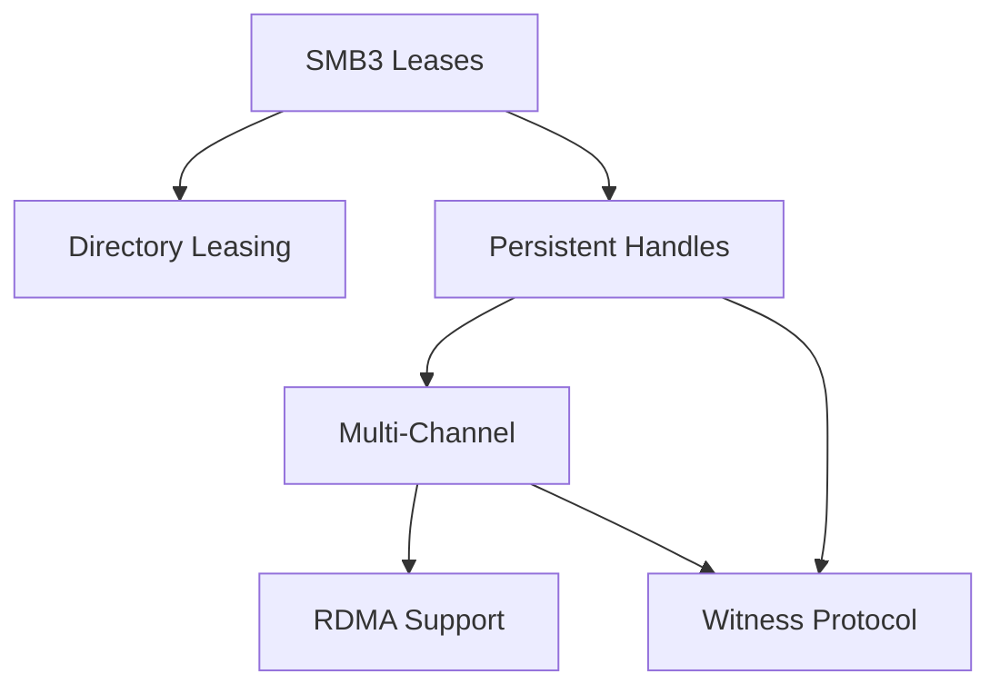

# SMB3 Advanced Features Implementation Plan

## Overview
This document outlines the implementation plan for advanced SMB3 features that are currently not implemented in JCIFS. These features are essential for enterprise-grade SMB3 support, providing enhanced performance, reliability, and scalability.

## Implementation Phases

### Phase 1: SMB3 Lease Implementation (Foundation)
**Priority: HIGH** | **Estimated Effort: 3-4 weeks**

SMB3 leases replace the traditional oplock mechanism and are foundational for other features.

#### 1.1 Core Lease Infrastructure
```
Package: org.codelibs.jcifs.smb.internal.smb2.lease
├── Smb2LeaseBreak.java          - Lease break notification handling
├── Smb2LeaseContext.java        - Lease context for create requests
├── Smb2LeaseKey.java            - 16-byte lease key management
├── Smb2LeaseState.java          - Lease state flags (R, H, W)
└── LeaseManager.java            - Central lease management
```

#### 1.2 Implementation Tasks
- [ ] Define lease state constants (SMB2_LEASE_READ, SMB2_LEASE_HANDLE, SMB2_LEASE_WRITE)
- [ ] Implement lease key generation and management
- [ ] Add lease context to Create request/response
- [ ] Implement lease break notification handling
- [ ] Modify SmbFile to support lease-based caching
- [ ] Add lease upgrade/downgrade logic
- [ ] Implement lease epoch tracking for v2 leases

#### 1.3 Integration Points
- Modify `Smb2CreateRequest` to include lease contexts
- Update `SmbFile` caching logic to use leases
- Add lease break handling in `SmbTransport`

---

### Phase 2: Persistent Handles
**Priority: HIGH** | **Estimated Effort: 4-5 weeks**

Persistent handles allow connections to survive network interruptions and server failovers.

#### 2.1 Core Persistent Handle Infrastructure
```
Package: org.codelibs.jcifs.smb.internal.smb2.persistent
├── PersistentHandleContext.java     - Persistent handle create context
├── PersistentHandleManager.java     - Handle persistence management
├── DurableHandleRequest.java        - Durable handle v1 support
├── DurableHandleV2Request.java      - Durable handle v2 with timeout
└── HandleReconnector.java           - Automatic handle reconnection
```

#### 2.2 Implementation Tasks
- [ ] Implement persistent/durable handle contexts
- [ ] Add handle GUID generation and tracking
- [ ] Implement handle state serialization
- [ ] Create reconnection logic with handle replay
- [ ] Add timeout management for durable handles
- [ ] Implement handle lease association
- [ ] Add persistent handle capability negotiation
- [ ] Create handle cache for reconnection

#### 2.3 Integration Points
- Extend `SmbFile` with persistent handle support
- Modify `SmbSession` for handle replay during reconnection
- Update `Smb2CreateRequest/Response` for durable contexts

---

### Phase 3: Multi-Channel Support
**Priority: MEDIUM** | **Estimated Effort: 5-6 weeks**

Multi-channel enables using multiple network connections for improved performance and reliability.

#### 3.1 Core Multi-Channel Infrastructure
```
Package: org.codelibs.jcifs.smb.internal.smb2.multichannel
├── ChannelManager.java           - Manage multiple channels per session
├── ChannelBinding.java           - Channel binding and security
├── ChannelSequence.java          - Request sequencing across channels
├── NetworkInterfaceInfo.java     - Network interface discovery
├── ChannelLoadBalancer.java      - Load distribution logic
└── ChannelFailover.java         - Channel failure handling
```

#### 3.2 Implementation Tasks
- [ ] Implement FSCTL_QUERY_NETWORK_INTERFACE_INFO
- [ ] Create channel binding hash calculation
- [ ] Implement channel establishment protocol
- [ ] Add request distribution algorithm
- [ ] Create channel synchronization mechanism
- [ ] Implement channel failure detection
- [ ] Add automatic channel recovery
- [ ] Create channel performance monitoring

#### 3.3 Integration Points
- Modify `SmbTransportPool` for multiple connections per session
- Update `SmbSession` for multi-channel awareness
- Enhance `SmbTransport` for channel management

---

### Phase 4: Directory Leasing
**Priority: MEDIUM** | **Estimated Effort: 2-3 weeks**

Directory leasing extends the lease concept to directories for improved metadata caching.

#### 4.1 Core Directory Lease Infrastructure
```
Package: org.codelibs.jcifs.smb.internal.smb2.lease
├── DirectoryLeaseContext.java    - Directory-specific lease context
├── DirectoryLeaseCache.java      - Directory metadata cache
└── DirectoryChangeNotifier.java  - Directory change tracking
```

#### 4.2 Implementation Tasks
- [ ] Extend lease implementation for directories
- [ ] Implement directory metadata caching
- [ ] Add directory change notification integration
- [ ] Create parent-child lease relationships
- [ ] Implement directory lease break handling
- [ ] Add directory enumeration caching

#### 4.3 Integration Points
- Extend `SmbFile` for directory lease support
- Modify directory listing operations for caching
- Update change notification handling

---

### Phase 5: RDMA (SMB Direct) Support
**Priority: LOW** | **Estimated Effort: 8-10 weeks**

RDMA provides high-speed, low-latency data transfer for supported network adapters.

#### 5.1 Core RDMA Infrastructure
```
Package: org.codelibs.jcifs.smb.internal.smb2.rdma
├── RdmaTransport.java           - RDMA transport implementation
├── RdmaCapability.java          - RDMA capability detection
├── RdmaNegotiate.java           - RDMA negotiation context
├── RdmaBuffer.java              - RDMA buffer management
├── RdmaChannel.java             - RDMA channel operations
└── RdmaProvider.java            - RDMA provider abstraction
```

#### 5.2 Implementation Tasks
- [ ] Research Java RDMA libraries (e.g., DiSNI, JXIO)
- [ ] Implement RDMA capability detection
- [ ] Create RDMA negotiation context
- [ ] Implement RDMA transport layer
- [ ] Add RDMA buffer registration
- [ ] Create RDMA read/write operations
- [ ] Implement RDMA credits management
- [ ] Add fallback to TCP when RDMA unavailable

#### 5.3 Integration Points
- Create new transport type alongside TCP
- Modify negotiation to include RDMA contexts
- Update read/write operations for RDMA

---

### Phase 6: Witness Protocol
**Priority: LOW** | **Estimated Effort: 4-5 weeks**

Witness protocol enables rapid failover notification for clustered file servers.

#### 6.1 Core Witness Infrastructure
```
Package: org.codelibs.jcifs.smb.internal.witness
├── WitnessClient.java           - Witness client implementation
├── WitnessRegistration.java     - Client registration with witness
├── WitnessNotification.java     - Notification handling
├── ResourceChange.java          - Resource change events
└── WitnessTransport.java       - Witness-specific RPC transport
```

#### 6.2 Implementation Tasks
- [ ] Implement Witness RPC protocol
- [ ] Create witness service discovery
- [ ] Implement client registration
- [ ] Add notification callback mechanism
- [ ] Create resource monitoring
- [ ] Implement automatic re-registration
- [ ] Add cluster node tracking
- [ ] Create failover coordination

#### 6.3 Integration Points
- Integrate with `CIFSContext` for witness support
- Modify `SmbTransport` for failover handling
- Update `DfsResolver` for witness-aware resolution

---

## Implementation Dependencies



## Testing Strategy

### Unit Tests
- Individual component testing for each feature
- Mock-based testing for protocol interactions
- State machine validation

### Integration Tests
- Feature interaction testing
- Network failure simulation
- Performance benchmarking
- Compatibility testing with Windows Server 2016/2019/2022

### Test Infrastructure Requirements
- Windows Server test environment with:
  - Failover clustering
  - RDMA-capable network adapters
  - DFS namespace
  - Multiple network interfaces

## Configuration Properties

```properties
# Lease configuration
org.codelibs.jcifs.smb.impl.client.useLeases=true
org.codelibs.jcifs.smb.impl.client.leaseTimeout=30000

# Persistent handles
org.codelibs.jcifs.smb.impl.client.usePersistentHandles=true
org.codelibs.jcifs.smb.impl.client.durableTimeout=120000

# Multi-channel
org.codelibs.jcifs.smb.impl.client.useMultiChannel=true
org.codelibs.jcifs.smb.impl.client.maxChannels=4
org.codelibs.jcifs.smb.impl.client.channelBindingPolicy=required

# Directory leasing
org.codelibs.jcifs.smb.impl.client.useDirectoryLeasing=true
org.codelibs.jcifs.smb.impl.client.dirCacheTimeout=60000

# RDMA
org.codelibs.jcifs.smb.impl.client.useRDMA=auto
org.codelibs.jcifs.smb.impl.client.rdmaProvider=disni

# Witness
org.codelibs.jcifs.smb.impl.client.useWitness=true
org.codelibs.jcifs.smb.impl.client.witnessNotificationTimeout=5000
```

## Risk Assessment

### Technical Risks
1. **RDMA Complexity**: Limited Java RDMA support may require JNI
2. **Multi-Channel Synchronization**: Complex thread synchronization required
3. **Persistent Handle State**: Requires reliable state persistence mechanism
4. **Backward Compatibility**: Must maintain compatibility with SMB2/SMB1

### Mitigation Strategies
1. Implement features behind configuration flags
2. Provide graceful fallback mechanisms
3. Extensive testing with various server configurations
4. Phased rollout with beta testing

## Resource Requirements

### Development Team
- 2-3 Senior Java developers with SMB protocol expertise
- 1 QA engineer for test infrastructure
- 1 DevOps engineer for CI/CD setup

### Timeline
- **Total Duration**: 6-8 months for all features
- **Phases 1-2**: 2-3 months (High priority)
- **Phases 3-4**: 2 months (Medium priority)
- **Phases 5-6**: 2-3 months (Low priority)

### Infrastructure
- Windows Server test lab
- RDMA-capable test hardware
- Continuous integration environment
- Performance testing infrastructure

## Success Metrics

1. **Functional Completeness**: All features pass Windows Protocol Test Suite
2. **Performance**: 
   - Multi-channel provides >1.5x throughput improvement
   - RDMA reduces latency by >50%
3. **Reliability**: 
   - Persistent handles survive 99% of network interruptions
   - Witness protocol achieves <5 second failover time
4. **Compatibility**: Works with Windows Server 2016+ and Azure Files

## Next Steps

1. **Immediate Actions**:
   - Set up Windows Server test environment
   - Create detailed technical specifications for Phase 1
   - Identify and evaluate Java RDMA libraries

2. **Phase 1 Kickoff**:
   - Begin SMB3 lease implementation
   - Create comprehensive test suite
   - Document API changes

3. **Community Engagement**:
   - Announce implementation plan
   - Solicit feedback from users
   - Identify beta testers for early access

## References

- [MS-SMB2]: Server Message Block (SMB) Protocol Version 2 and 3
- [MS-SWN]: Service Witness Protocol
- [MS-SMBD]: SMB2 Remote Direct Memory Access (RDMA) Transport Protocol
- Windows Protocol Test Suites
- SMB3 Protocol Documentation